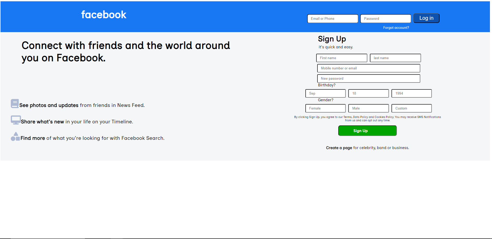

# facebook-homepage
My Daily Codewars!

#### This is my attempt at recreating Facebook Homepage

## How it's Made:
Tech used: HTML, CSS

I used HTML & CSS to recreate the facebook homepage

## Optimizations
I'd like to go back and redo the site with flex

## Lessons Learned
This was the first project i believed i had gotten a solid grasp of CSS with from learning how border-radius & exsact color codes work in hand with the styling of a site

## Example
Take a look at these example that i have below:

